# GitHub 101

This guide will help you navigate GitHub with ease.

 

## Setting Up GitHub Desktop

1. Start by downloading and installing the [GitHub Desktop app](https://desktop.github.com/).
2. Sign in using your GitHub account.
3. Pick the repository you'd like to work on.

    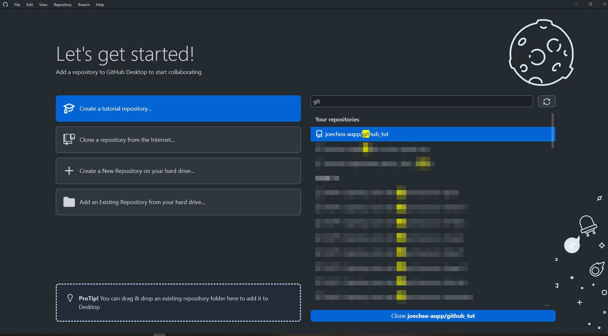

4. Choose a local folder where you'll store the project.

    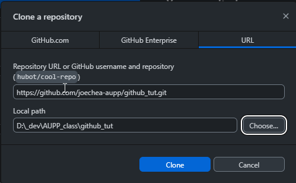

5. Click 'Clone' to download the project to your local folder.

 

## Making Changes and Committing

1. Make any changes you want to the project.
2. Open the GitHub Desktop app to see the changes you've made.

    

3. To save your changes or commit the history, go to the bottom left of the screen, give your change history a title, and click on `commit to main`.

    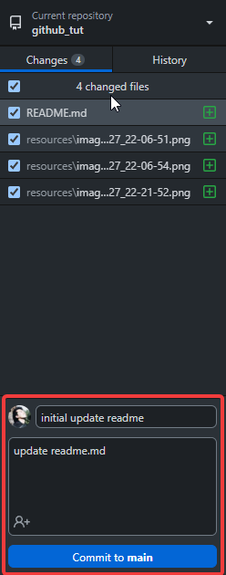

4. Once you've committed, your changed file will no longer appear in the left menu.
5. Click `Push origin` to upload your changes to GitHub.

    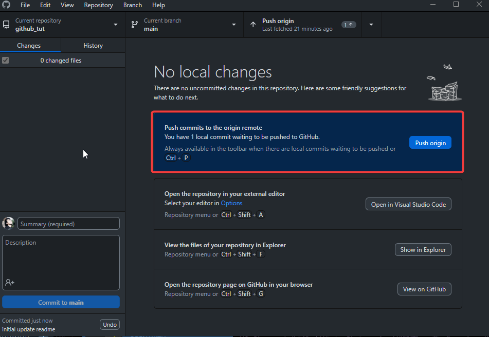

 

## Creating Repositories on GitHub

1. Sign in to your GitHub account on your preferred web browser.

    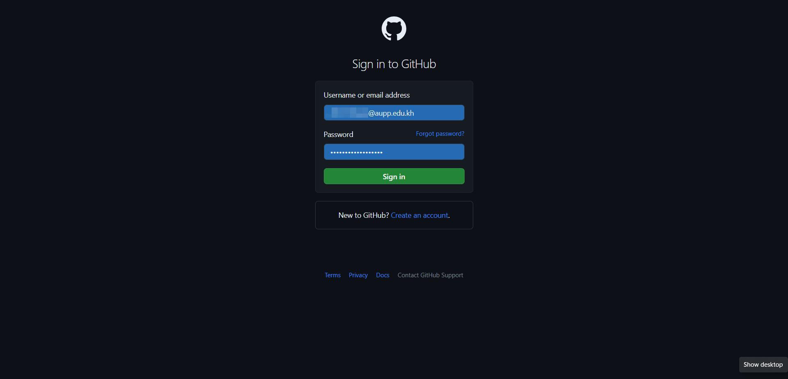

2. Click on the `+` button at the top right of the screen and select `New repository`.

    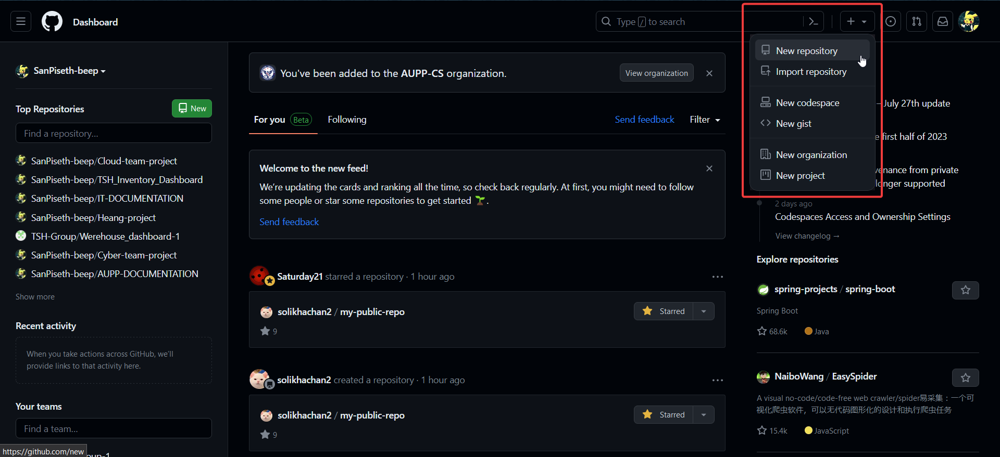

3. Give your repository a name and, if you want, add a description.

    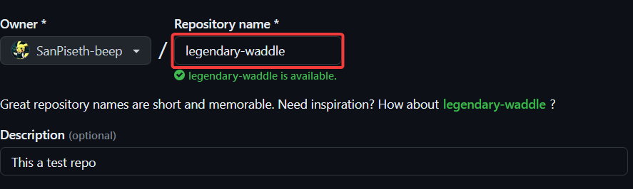

4. Make sure the repository is set to `Public`.

    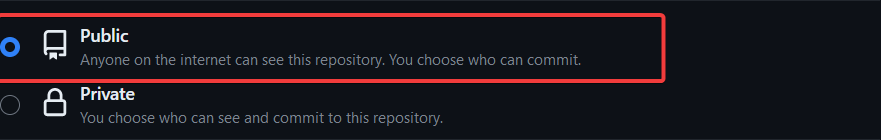

5. Click on `add a README file` and then `Create repository`.

    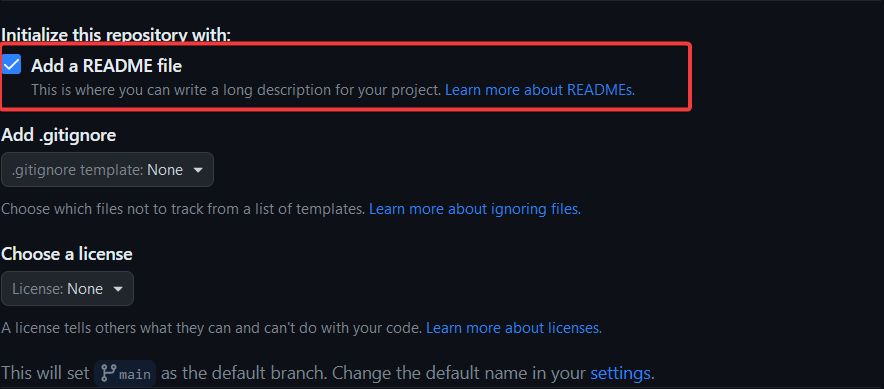

 

## Changing Repository Remote Origin

1. Copy the URL of the new repository you want to switch to.

    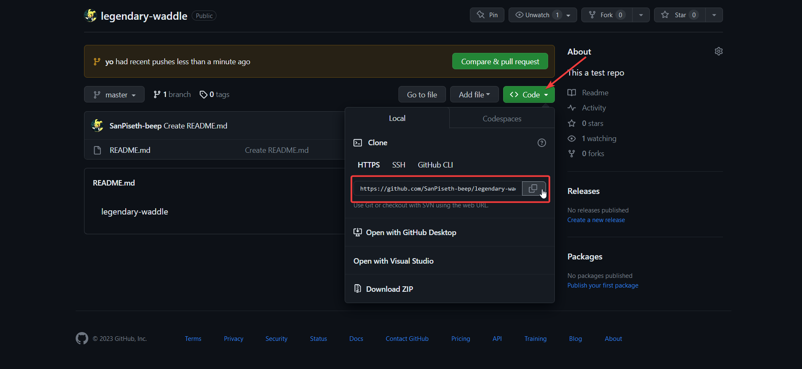

2. Open the repository you want to change from in VS Code and open the terminal.

    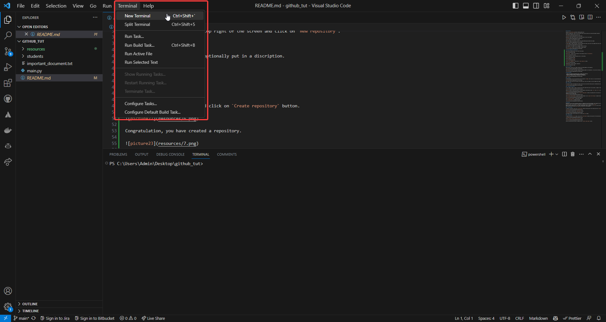

3. Type `git remote set-url origin <new repository url>` and press enter.

    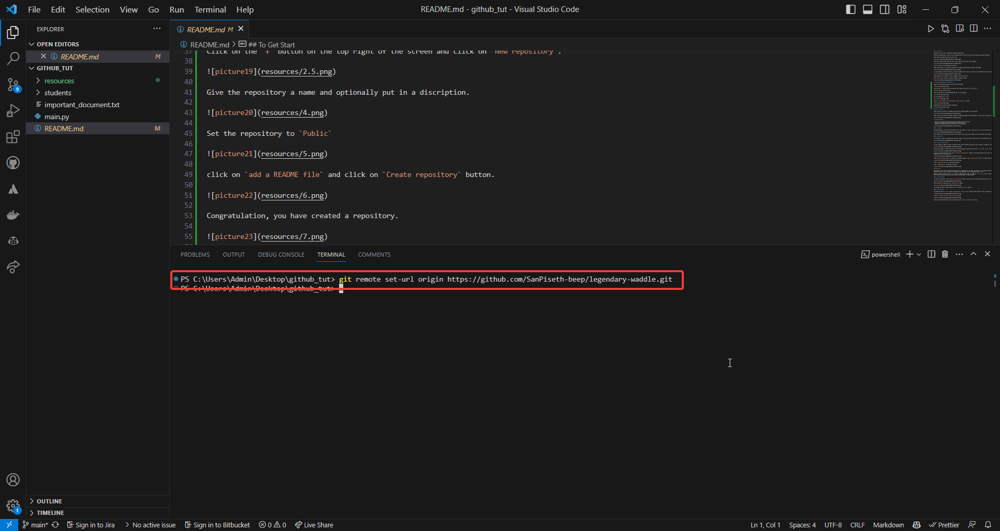

4. Add, commit, and push the changes to the new repository using the VS Code UI.

    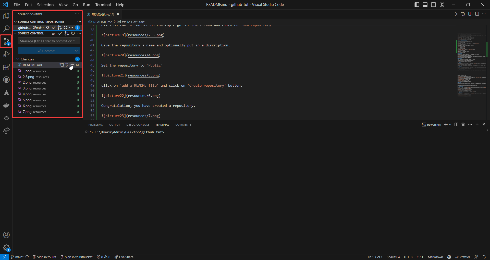

 

## Understanding Git in VS Code

- Green vertical lines next to line numbers show incoming updates to the repository.

    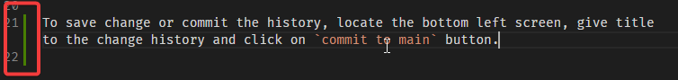

- Blue vertical lines next to line numbers show outgoing updates to the repository. Click on the blue line to see the changes you've made.

    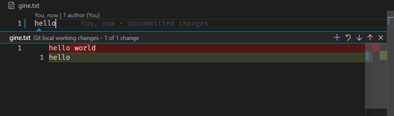

 

## Using GitHub Desktop

- Green = data **added** to the repository
- Red = data **deleted** from the repository
- Orange = **modified data** in the repository

    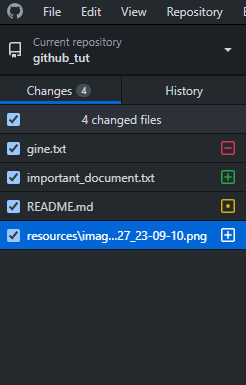

 

## Understanding History, Reverting Changes, and Resolving Conflicts

1. In GitHub Desktop, you'll see the history tab to the right of the `Changes` tab. Click on it to see the repository's history.

    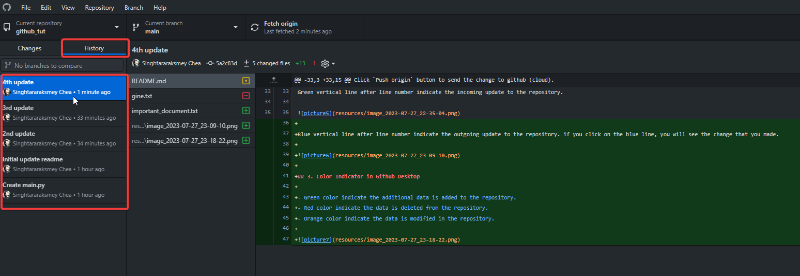

2. To undo changes, right-click on any history you want to revert and click on `Revert changes in commit`.

    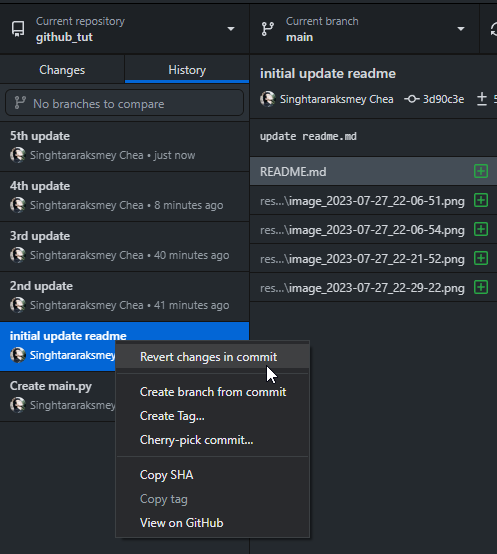

3. If your changes affect or are about to overwrite the current content in your project, a prompt to resolve conflicts will appear.

    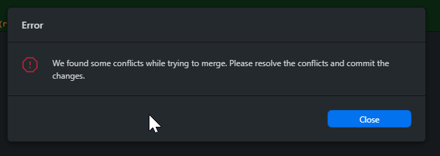

4. Switch to VS Code to resolve the conflict. Files marked as conflicted will have `>>>>>>` and `<<<<<<` in the file and will be colored in red or orange.

    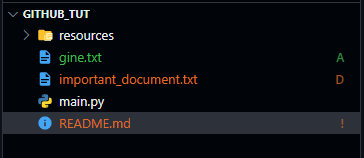

5. Click on the conflicted file and click on `Resolve in Merge Editor`. The incoming changes will be on the left side and the outgoing changes will be on the right side.

    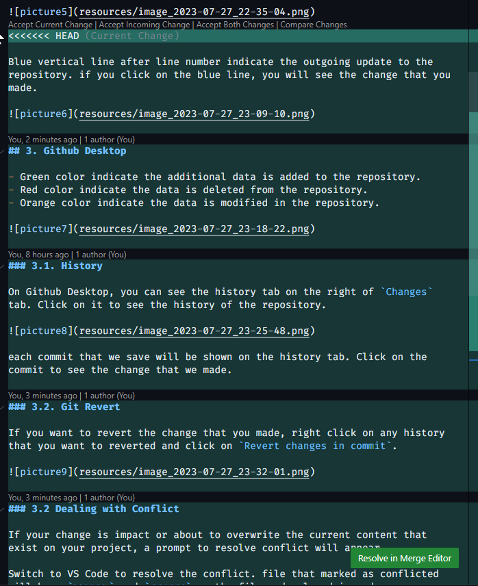

6. Click `Accept Incoming Change` to accept the incoming changes, `Accept Current Change` to accept the outgoing changes, or `Accept Both Changes` to accept both.

7. Click `Complete Merge` to finish the merge.

    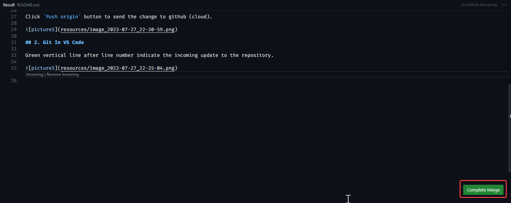

 

## Branching

Branching lets you work on different versions of a repository at the same time. By default, your repository has one branch named `main`, which is considered the definitive branch. We use branches to experiment and make edits before committing them to `main`.

1. To create a new branch, click on the `Current Branch` button at the top left of the screen and click on `New Branch`.

    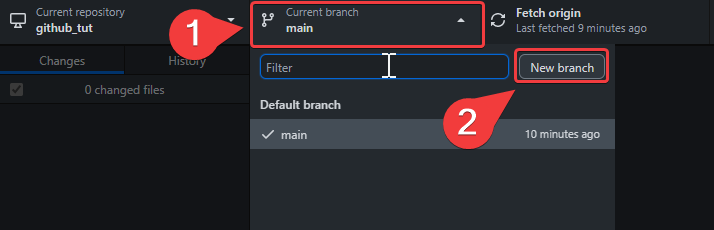

2. Give your branch a name and click `Create Branch`.

    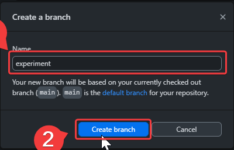

3. Any changes you make on the new branch won't affect the `main` branch.

4. To merge the branch into the `main` branch, click on the `Current Branch` button at the top left of the screen and click on the `main` branch.

    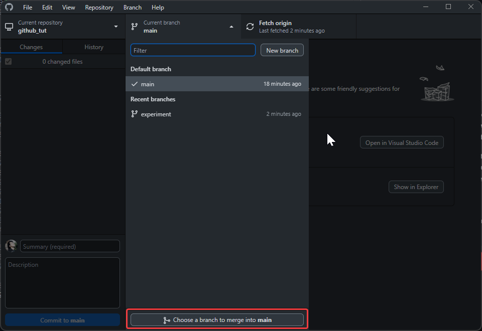

5. Click on `Choose a branch to merge into main`.

    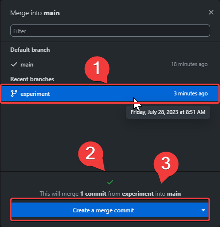

6. Click on the branch you want to merge and click `Create a merge commit`.

 

## Resources

### VS Code Extensions for GitHub

- [GitHub Pull Requests and Issues](https://marketplace.visualstudio.com/items?itemName=GitHub.vscode-pull-request-github)
- [GitLens](https://marketplace.visualstudio.com/items?itemName=eamodio.gitlens)

### YouTube Tutorials

- [GitHub Desktop Tutorial](https://www.youtube.com/watch?v=8Dd7KRpKeaE)
- [Git and GitHub Crash Course](https://www.youtube.com/watch?v=tRZGeaHPoaw)

### Additional Sources

- [GitHub Learning Lab](https://github.com/apps/github-learning-lab)
- [GitHub Docs](https://docs.github.com/en)
