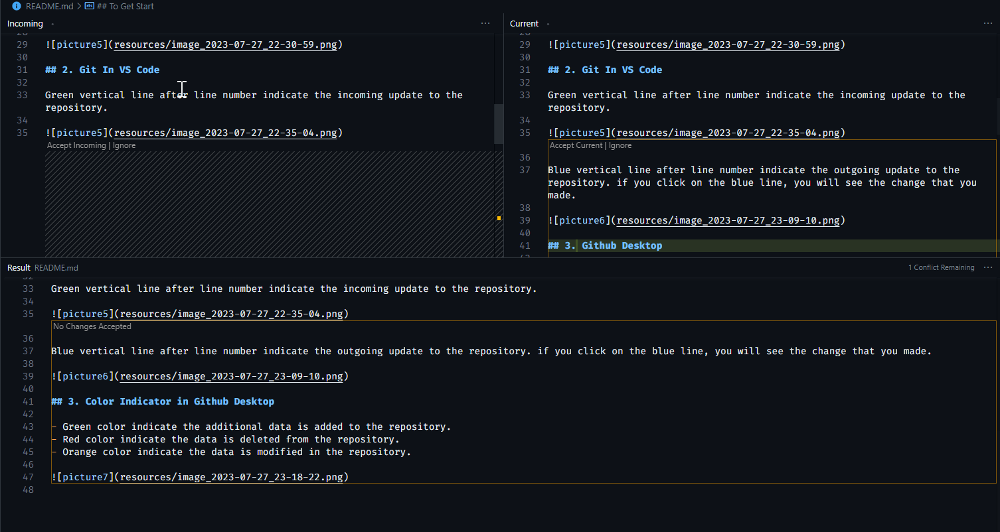

## To Get Start

Download [GitHub Desktop app](https://desktop.github.com/)

Install the application, sign-in with you github account (the one that you are using with github classroom)

then chose the repository that you just fork

Once done, choose folder that you want to store the project on your local computer

click on clone to start download the project.

After made change on the project, go back to the github desktop app and observe the change

To save change or commit the history, locate the bottom left screen, give title to the change history and click on `commit to main` button.

once commited, your change file will disappear from the left menu.

Click `Push origin` button to send the change to github (cloud).

## 2. Git In VS Code

Green vertical line after line number indicate the incoming update to the repository.

Blue vertical line after line number indicate the outgoing update to the repository. if you click on the blue line, you will see the change that you made.

## 3. Github Desktop

- Green color indicate the additional data is added to the repository.
- Red color indicate the data is deleted from the repository.
- Orange color indicate the data is modified in the repository.

### 3.1. History

On Github Desktop, you can see the history tab on the right of `Changes` tab. Click on it to see the history of the repository.

each commit that we save will be shown on the history tab. Click on the commit to see the change that we made.

### 3.2. Git Revert

If you want to revert the change that you made, right click on any history that you want to reverted and click on `Revert changes in commit`.

### 3.2 Dealing with Conflict

If your change is impact or about to overwrite the current content that exist on your project, a prompt to resolve conflict will appear.

Switch to VS Code to resolve the conflict. file that marked as conflicted will have `>>>>>>` and `<<<<<<` on the file and colored in red or orange.

click on the conflicted file and click on `Resolve in Merge Editor` button on the bottom left of the screen. the incoming change will be on the left side and the outgoing change will be on the right side.

click `Accept Incoming Change` to accept the incoming change or click `Accept Current Change` to accept the outgoing change.

click `Accept Both Changes` to accept both change.

click `Complete Merge` to complete the merge.

## Branching

Branching is a way to work on different version of a repository at one time. By default, your repository has one branch named `main` which is considered to be the definitive branch. We use branches to experiment and make edits before committing them to `main`.

When you create a branch off the `main` branch, you’re making a copy, or snapshot, of `main` as it was at that point in time. If someone else made changes to the `main` branch while you were working on your branch, you could pull in those updates.

### 1. Create Branch

To create a new branch, click on the `Current Branch` button on the top left of the screen and click on `New Branch`.

Give the branch a name and click `Create Branch` button.

Any change you made on the new branch will not affect the `main` branch.
